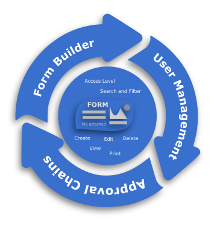



    

  
    
    

<strong>MTD Key OrderMaker</strong> is a free, open source solution web builder for small and medium businesses that assists to improve the request management process and collaboration among employees. In large companies, this solution can be used by managers to collect data from remote branches and generate reports based on the collected data.

You can create request management systems, knowledge-based systems, decision-making systems, or any other business application using the form builder, approval chain configurator, and user management module.

<table>
    <tr>
        <td>
            

            
<b>Form Builder</b>

            The form builder will help you quickly and correctly collect information and export data to Excel for analysis.
            
 
            
<b>Approval Chains</b>

            Create an approval process and you'll have enough information to make a decision.
            

            
<b>User Management</b>

            Use row-level security for a list of documents applying Group Access Policy and grant users access to parts of documents.
            

        </td>
        <td>
             
        </td>
    </tr>
</table>

## How to start
Video: <a href="https://youtu.be/d1oIlVedyVw">Demo of the request management system</a>

    Read more: <a target="_blank" href="https://mtdkey.com/ordermaker">OrderMaker Details</a>

Try Now:  <a target="_blank" href="https://demo.mtdkey.com">Demo Server</a>

## License

Copyright (c) – presented by [Oleg Bruev](https://github.com/olegbruev/).  
MTD Key OrderMaker is free and open-source software licensed under the MIT License.

